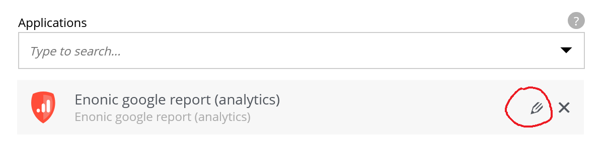
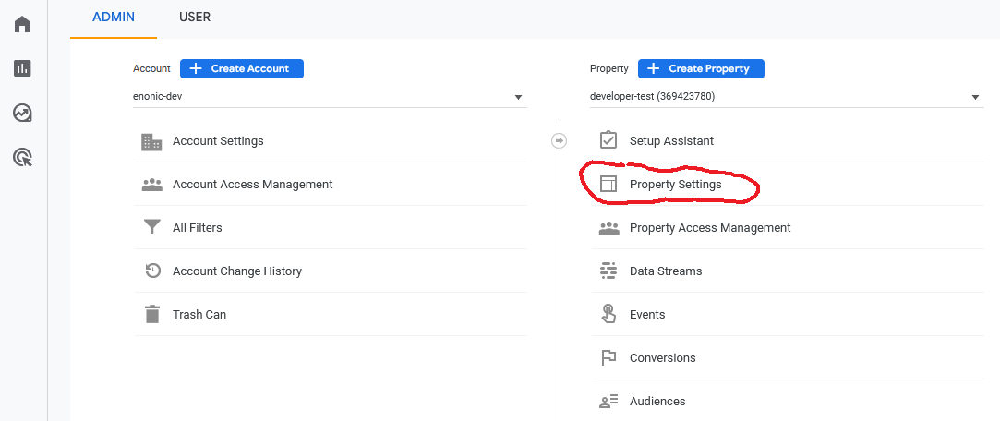
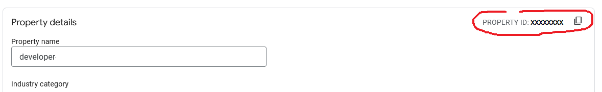
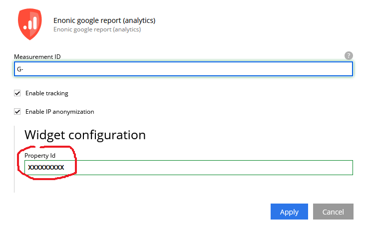
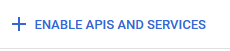

# Google Analytics for Enonic XP

This guide will help you set up Google Analytics app for Enonic XP.

IMPORTANT: This integration requires a Google Analytics 4 account and will not support deprecated Universal Analytics.

:toc:

## Tracking

To enable tracking script on your site you will need "Measurement ID" from Google Analytics.

. In Google Analytics console select the correct account for your website, then click the cog icon located on the bottom left.

. Click "Data Streams" in the right-hand menu:

image::images/AdminPanel.png[]

3 . Click a data stream on the "Web" tab to open the Web stream details:

image::images/DataStream.png[]

4 . Locate "Measurement ID" and use the icon next to it to copy value to the clipboard.

Now add this value to site config inside Content Studio.

5 . Log in to Enonic XP and open Content Studio.

TIP: If you haven't already installed the "Google Analytics" app, do that in the Applications tool found in the XP Launcher panel
(use "XP" icon in the top-right corner to open it).

6 . In Content Studio edit your site and add "Google Analytics" application to it, then open app config (click the "pencil icon"):



7 . Paste value from the clipboard to the "Measurement ID" config field and enable tracking by checking off "Enable tracking" checkbox.

image::images/AppSettings.png[]

That's it. When you publish the site, the tracking script will go live and will start collecting data for analytics.

## Widget

Setting up the widget has a few more steps, but gives a nice overview over statistics collected for the site.

IMPORTANT: The following setup will require access to configuration files on the server hosting Enonic XP.

. Open the Analytics admin page (click the cog icon located on the bottom left)

. Click Property Settings in the right-hand menu:



3 . Locate "Property ID" and use the icon next to it to copy value to the clipboard.



4 . Paste the value into "Property Id" field in the app config form in Content Studio:



You are done with the site setup.

Now let's set up a service account and configure the app:

. Go to https://console.cloud.google.com[Google Cloud console] and create an account, if you haven't already done so.

. Go to "https://console.cloud.google.com/apis/dashboard[APIs & Services]" and click the "+ Enable APIs and Services" button:



3 . Search for *Google Analytics Data API*, select it and click "Enable" button.

4 . Go to https://console.cloud.google.com/iam-admin[IAM & Admin] and select "Service Accounts" from the submenu:

image::images/CloudAdminServiceAccounts.png[]

5 . Create a new service account that will access the API you enabled. This will be used to access the analytics data.
Give it any name and generate "Service account ID" (email address), then click "Create and Continue":

image::images/ServiceAccountCreate.png[]

6 . Click the new service account you have just created and go to the "Keys" tab.

image::images/ServiceAccountKeys.png[]

7 . Add a new key of type *json*. Json file will be generated and automatically downloaded to your computer. Securely store this file.

8 . Create app configuration file called `com.enonic.app.ga.cfg` in the `{xp_home}/config` folder on the server hosting Enonic XP.

9 . Add this line to the config file:

`ga.credentialPath = ${xp.home}/config/<key_file_name.json>`

where `key_file_name.json` should be replaced with name of the key file you downloaded.

10 . Upload the key file itself to the server and add it to the same folder where the app config file is.

Now the credentials are set up.

What's left is to give access to your service account in Google Analytics.

1 . Go back to the service account list and copy email address of the new service account.

2 . Go to "Property Access Management" in the Google Analytics Admin:

image::images/ProperyAccessManagment.png[]

3 . Add a new user:

image::images/NewPropertyUser.png[]

4 . Use the email address of your service account. It only needs the viewer role for the analytics data.

After adding the user the widget should work and show data for your site.

## Maps API key

If you want to enable Google Maps API (to show world map in the GA widget), then you will need to enable the Google Analytics API.

. Go to https://console.cloud.google.com/apis/dashboard[APIs & Services]

. Press the "Enable APIs and services" and search for `maps javascript api`.

. Enable the API and you will get a maps API key.

. Add this line to the config file:

`ga.mapsApiKey = <google_maps_api_key_here>`

## Content Security Policy

The widget uses remote assets (fonts, styles and scripts from Google servers) that are by default blocked by Content Studio's Content Security Policy.
To enable resources required for Google Analytics, add this line to the Content Studio's config file (`/{$xp_home}/config/com.enonic.app.contentstudio.cfg`):

.com.enonic.app.contentstudio.cfg
```
contentSecurityPolicy.header=default-src 'self' https://*.gstatic.com; connect-src 'self' ws: wss: https://*.gstatic.com https://*.googleapis.com; script-src 'self' 'unsafe-eval' 'unsafe-inline' https://*.google.com https://*.googleapis.com https://*.gstatic.com; object-src 'none'; style-src 'self' 'unsafe-inline' http://*.googleapis.com https://*.googleapis.com https://*.gstatic.com; img-src 'self' https://*.gstatic.com data:; frame-src 'self' https://*.googleapis.com;
```
