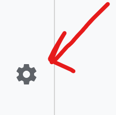

# App-google-report
How to setup the google report app with Enonic XP.

:toc:

## Tracking

Setting up the tracking only required one value to the application set on the site. Setting up the widget requires a couple addition steps.

The app requires a google analytics acount setup for the site you want to track.

In google analytics go to admin settings

The settings are located on the bottom left

There should be a datastream connected to the site for tracking

image::images/AdminPanel.png[]

Opening up the data stream and select the one for the site we want to track.

image::images/DataStream.png[]

Find its measureId and copy the value. (Use the icon next to it)

Now we jsut need to add this value to our site in Enonic

Just login to the server.
If you have not allready installed the google report application do that in the application tool found when opening the dashboard.

In content studio add the application to your site
And open up settings for this app (pencil icon)

image::images/SiteApplication.png[]

In the site settings simply add a new measureId and enable tracking.

image::images/AppSettings.png[]

Thats it. If you publish the site now the tracking will be live and you can track user data.

## Widget

Setting up the widget has a few more steps, but gives a nice overview over the statistics of the site.
The next setup will require file access to the servers configuration files

In the analytics admin page. (Cog wheel at the bottom left of the page)

Find the Property Settings and press it to show its related information.

image::images/PropertySettings.png[]

When opening it find its property ID and copy it

image::images/PropertyId.png[]

Paste it into the app settings in content studio

image::images/AppSettingsPropertyId.png[]

Now that we are done with the site setup. We just have to configuration couple of apis and setting the authentication
This is done with a service account in the app configuration file.

First create an account in https://console.cloud.google.com
This is where we will create a service account for authentication with our app.

After creating an account open up the IAM & Admin page and the Service Accounts sub menu

image::images/CloudAdminServiceAccounts.png[]

Create a new service account. This will be used to access the analytics data.
Give it any name and generate an email address for the service account.

image::images/ServiceAccountCreate.png[]

After creating the serivice we need to enable the apis that it will access

Go to our APIs & Services on https://console.cloud.google.com/apis/dashboard

On the page press the button to enable apis and services

image::images/Enable_APIs.png[]

Enable the *Google Analytics Data API*

It should now have access to the api. We will later add it to our google analytics service.

With this service we will need to create a access key.
Click the new service key that we just created an go to the keys tab.

image::images/ServiceAccountKeys.png[]

Add a new key. Its needs to be of type *json*

Securley store this key. We will need to upload it to the server hosting enonic.

Go back to the overview of all accounts and copy the email adresse of our service

We need to copy the data to our home/config folder on the server

The configuration files on the server are located here:

`/home/config`

We need to create a configuration file for our app.

`com.enonic.app.ga.cfg`

We need to put our developer key in the same folder.
This allows our app to access it.

now in the `com.enonic.app.ga.cfg` file we need to add these values:

ga.credentialPath = ${xp.home}/config/<key_file_name.json>

Replce key_file_name with the filename of the key we downloaded.

Now the credentials are setup.

We just need to give access to our service account in google analytics.

Just go to Property Access Management in our google analytics

image::images/ProperyAccessManagment.png[]

Add a new user in property access managment.

image::images/NewPropertyUser.png[]

Use the email address of our service account.
It only needs the viewer role for the analytics data.

After adding the user the widget should work and show data for your site.

## Maps api key

If you want to enable google maps api too, then you will need to eneable the google analtycis api.

Go to our APIs & Services on https://console.cloud.google.com/apis/dashboard

Press the enable apis and services and search for the `maps javascript api`
You will get a maps api key after enabling it.

ga.mapsApiKey = <google_maps_api_key_here>

## Content Security policy.

The widget uses a lot of remote resources and that is by default blocked in content studio.

Here is the content studio configuration of the content security policy needed to show the widget

The configration location is `/home/config`

`com.enonic.app.contentstudio.cfg`
contentSecurityPolicy.header=default-src 'self' https://*.gstatic.com; connect-src 'self' ws: wss: https://*.gstatic.com https://*.googleapis.com; script-src 'self' 'unsafe-eval' 'unsafe-inline' https://*.google.com https://*.googleapis.com https://*.gstatic.com; object-src 'none'; style-src 'self' 'unsafe-inline' https://*.googleapis.com https://*.gstatic.com; img-src 'self' https://*.gstatic.com data:; frame-src 'self' https://*.googleapis.com;

